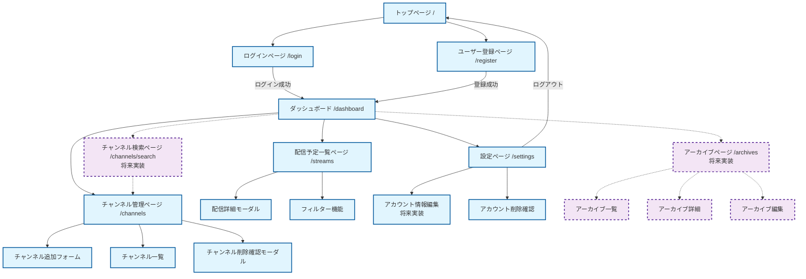
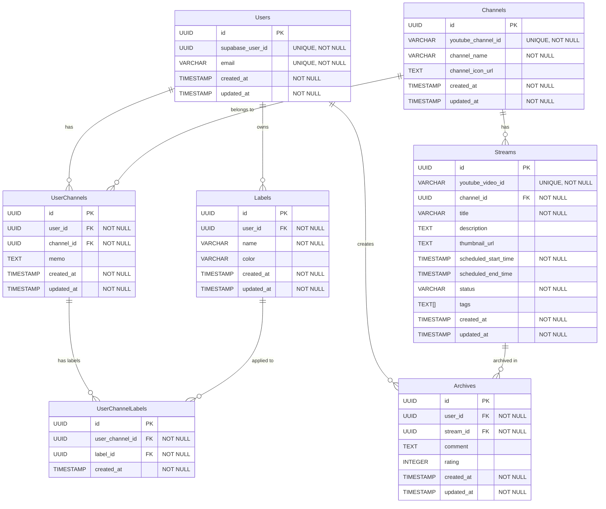

# 配信予定トラッカー（Stream Schedule Tracker） 要件定義書

## 1. システム概要

### 1.1 プロジェクト名
配信予定トラッカー（Stream Schedule Tracker）

### 1.2 コンセプト
自分が好きなYouTubeチャンネルの直近の配信予定やその内容を一覧化して、視聴したい配信を簡単に比較・選択できるWebアプリケーション。

### 1.3 目的
YouTubeの標準機能では、配信開始時の通知しか受け取れず、事前に配信予定を一覧で比較することが困難である。本システムは、ユーザーが登録した複数のチャンネルの配信予定を一元管理し、視聴計画を立てやすくすることを目的とする。

### 1.4 ターゲットユーザー
- YouTubeの動画・配信を楽しむ趣味を持つ層
- 既存のYouTube検索機能や通知機能に不満を持っているユーザー
- 複数の配信者をフォローしており、配信予定を効率的に管理したいユーザー
- 初期フェーズ: 5人程度（スモールスタート）

### 1.5 解決する課題
1. **配信予定の早期把握**: チャンネル登録と通知ONだけでは配信開始時にしか通知が来ないが、もっと早い段階で配信予定を把握したい
2. **配信予定の比較**: 「今日の21時から何か視聴したい」という時に、好きな配信者の配信予定枠を横断的に比較して選択したい
3. **一元管理の欠如**: YouTubeのデフォルト機能では複数チャンネルの配信予定を一覧で見ることができない

### 1.6 類似既存サービス
- Vmiru（https://www.vmiru.tv/）
- ホロジュール（https://schedule.hololive.tv/）

### 1.7 基本利用フロー
1. ユーザーアカウント登録
2. 見たいYouTubeチャンネルのIDをアプリに登録（任意の数）
3. 定期ジョブ実行後、登録チャンネルの配信予定枠がアプリ上で閲覧可能になる
4. 配信予定を一覧で確認し、視聴する配信を選択

---

## 2. 機能要件

### 2.1 必須機能（MVP: Minimum Viable Product）

#### 2.1.1 ユーザー認証機能
| 機能ID | 機能名 | 説明 | 優先度 |
|--------|--------|------|--------|
| AUTH-001 | ユーザー登録 | メールアドレスとパスワードを用いた新規ユーザー登録 | 高 |
| AUTH-002 | ログイン | 登録済みユーザーの認証とセッション開始 | 高 |
| AUTH-003 | ログアウト | ユーザーセッションの終了 | 高 |
| AUTH-004 | アカウント削除 | ユーザーアカウントと関連データの完全削除 | 高 |

**実装詳細:**
- 認証基盤としてSupabaseを使用
- バックエンドでSupabaseの公開鍵を使ってJWTの妥当性をチェック
- 現時点では権限レベルの差異は設けない（認可機能は後回し）

#### 2.1.2 YouTubeチャンネル管理機能
| 機能ID | 機能名 | 説明 | 優先度 |
|--------|--------|------|--------|
| CHANNEL-001 | チャンネルID登録 | YouTubeチャンネルIDをユーザーアカウントに紐付けて登録 | 高 |
| CHANNEL-002 | チャンネルID削除 | 登録済みチャンネルIDの削除 | 高 |
| CHANNEL-003 | チャンネル一覧表示 | ユーザーが登録しているチャンネルの一覧表示 | 高 |
| CHANNEL-004 | チャンネル情報編集 | 登録済みチャンネルの付随情報（メモ）の編集 | 高 |

**実装詳細:**
- ユーザーは複数のチャンネルIDを登録可能
- チャンネルIDはYouTube URL形式またはID直接入力の両方に対応
- 登録時にチャンネルの存在確認を実施
- 各チャンネルにユーザーが任意のテキスト（メモ）を付随情報として登録可能

#### 2.1.3 配信予定情報取得機能（バッチ処理）
| 機能ID | 機能名 | 説明 | 優先度 |
|--------|--------|------|--------|
| BATCH-001 | 配信情報定期取得 | 登録チャンネルの配信予定をYouTube APIから定期的に取得 | 高 |

**実装詳細:**
- 実行頻度:
  - ゴールデンタイム（18:00-24:00）: 1時間おき
  - その他の時間帯: 3時間おき
- 取得情報:
  - 配信タイトル
  - 配信予定日時
  - 配信者名（チャンネル名）
  - サムネイル画像URL
  - 配信URL
  - 配信説明文
  - タグ情報
- YouTube API Quota制限を考慮した実装（無料枠内での運用）

#### 2.1.4 配信予定一覧表示機能
| 機能ID | 機能名 | 説明 | 優先度 |
|--------|--------|------|--------|
| VIEW-001 | 配信予定一覧画面 | ユーザーが登録したチャンネルの配信予定を時系列で一覧表示 | 高 |
| VIEW-002 | 配信詳細表示 | 個別配信の詳細情報を表示 | 高 |

**表示項目:**
- 配信予定日時
- 配信タイトル
- 配信者名
- サムネイル画像
- 配信ページへのリンク

#### 2.1.5 配信情報フィルター機能
| 機能ID | 機能名 | 説明 | 優先度 |
|--------|--------|------|--------|
| FILTER-001 | 配信者名フィルター | 配信者名での絞り込み表示 | 高 |
| FILTER-002 | タイトルフィルター | 配信タイトルでのキーワード検索 | 高 |
| FILTER-003 | タグフィルター | タグによる絞り込み表示 | 高 |
| FILTER-004 | 日時フィルター | 配信予定日時による絞り込み | 高 |

### 2.2 拡張機能（検討中・将来実装予定）

#### 2.2.1 アカウント管理拡張機能
| 機能ID | 機能名 | 説明 | 優先度 |
|--------|--------|------|--------|
| AUTH-101 | アカウント情報編集 | ユーザー名、メールアドレス等の編集 | 中 |
| AUTH-102 | アイコンアップロード | ユーザーアカウントのプロフィール画像設定 | 低 |

#### 2.2.2 アーカイブ管理機能
| 機能ID | 機能名 | 説明 | 優先度 |
|--------|--------|------|--------|
| ARCHIVE-001 | アーカイブ保存 | 終了した配信に感想やコメントを添えて保存 | 中 |
| ARCHIVE-002 | アーカイブ一覧 | 保存したアーカイブを一覧表示 | 中 |
| ARCHIVE-003 | アーカイブ編集 | 保存済みアーカイブの編集 | 中 |
| ARCHIVE-004 | アーカイブ削除 | 保存済みアーカイブの削除 | 中 |

#### 2.2.3 チャンネル検索機能
| 機能ID | 機能名 | 説明 | 優先度 |
|--------|--------|------|--------|
| SEARCH-001 | キーワードチャンネル検索 | キーワードからYouTubeチャンネルを検索 | 中 |
| SEARCH-002 | チャンネルプレビュー | 検索結果のチャンネル情報をプレビュー表示 | 中 |

#### 2.2.4 ラベル管理機能
| 機能ID | 機能名 | 説明 | 優先度 |
|--------|--------|------|--------|
| LABEL-001 | ラベル作成 | ユーザーが独自のラベル（「にじさんじ」「ホロライブ」等）を作成 | 中 |
| LABEL-002 | ラベル編集 | 作成済みラベルの名前・色等の編集 | 中 |
| LABEL-003 | ラベル削除 | 不要になったラベルの削除 | 中 |
| LABEL-004 | チャンネルラベル付与 | 登録チャンネルにラベルを付与 | 中 |
| LABEL-005 | ラベルフィルター | 配信予定一覧でラベルによる絞り込み表示 | 中 |

**実装詳細:**
- ユーザーごとに独自のラベルセットを管理可能
- 1つのチャンネルに複数のラベルを付与可能
- ラベルには名前と色情報を設定可能
- 配信予定一覧画面でラベルによるフィルタリングが可能

---

## 3. 非機能要件

### 3.1 パフォーマンス要件
| ID | 項目 | 要件 |
|----|------|------|
| PERF-001 | 画面表示速度 | 配信予定一覧画面は3秒以内に初期表示を完了 |
| PERF-002 | API応答時間 | サーバーサイドAPIは95%のリクエストで2秒以内に応答 |
| PERF-003 | バッチ処理時間 | 配信情報取得バッチは1チャンネルあたり平均5秒以内で処理 |

### 3.2 可用性要件
| ID | 項目 | 要件 |
|----|------|------|
| AVAIL-001 | システム稼働率 | 月間稼働率95%以上（スモールスタート期は緩和可） |
| AVAIL-002 | メンテナンス時間 | 定期メンテナンスは週次1時間以内、深夜帯実施 |

### 3.3 セキュリティ要件
| ID | 項目 | 要件 |
|----|------|------|
| SEC-001 | 認証 | Supabaseによる認証実装、バックエンドでJWTの妥当性をチェック |
| SEC-002 | 通信暗号化 | HTTPS通信の強制（HTTP接続は自動的にHTTPSへリダイレクト） |
| SEC-003 | データアクセス制御 | ユーザーは自身のデータのみアクセス可能 |
| SEC-004 | APIセキュリティ | 認証トークンによるAPI呼び出し制限 |

### 3.4 運用要件
| ID | 項目 | 要件 |
|----|------|------|
| OPS-001 | ログ保存 | アプリケーションログ、アクセスログは最低30日間保存 |
| OPS-002 | エラー監視 | システムエラー発生時は管理者へメール通知 |
| OPS-003 | バックアップ | データベースは日次バックアップを実施 |

### 3.5 外部API制約
| ID | 項目 | 要件 |
|----|------|------|
| API-001 | YouTube API Quota | YouTube Data API v3の無料枠（10,000 units/日）内で運用 |
| API-002 | APIエラーハンドリング | YouTube API呼び出し失敗時は再試行ロジックを実装（最大3回） |
| API-003 | レートリミット対応 | YouTube APIのレートリミットに達した場合は取得を延期 |

### 3.6 拡張性要件
| ID | 項目 | 要件 |
|----|------|------|
| SCALE-001 | ユーザー数 | 初期5ユーザー、将来的に100ユーザーまで対応可能な設計 |
| SCALE-002 | データ量 | 1ユーザーあたり最大100チャンネル登録可能 |

### 3.7 ユーザビリティ要件
| ID | 項目 | 要件 |
|----|------|------|
| USAB-001 | 対応ブラウザ | Chrome最新版、Firefox最新版、Safari最新版、Edge最新版 |
| USAB-002 | レスポンシブデザイン | デスクトップ、タブレット、スマートフォンに対応 |
| USAB-003 | 直感的UI | 初回利用者でも説明なしで基本操作が可能なUI設計 |

---

## 4. ユーザーストーリー

### 4.1 基本ユーザーストーリー

#### US-001: 新規ユーザー登録
**As a** 新規ユーザー
**I want to** メールアドレスとパスワードでアカウントを作成したい
**So that** システムを利用開始できる

**受け入れ条件:**
- メールアドレスとパスワード入力フォームが表示される
- パスワードは8文字以上、英数字混在を要求
- 登録完了後、自動的にログイン状態になる
- 既に登録済みのメールアドレスではエラーメッセージが表示される

#### US-002: YouTubeチャンネル登録
**As a** ログインユーザー
**I want to** 好きなYouTubeチャンネルのIDを登録したい
**So that** そのチャンネルの配信予定が確認できる

**受け入れ条件:**
- チャンネルIDまたはチャンネルURLを入力できる
- 登録時にチャンネルの存在確認が行われる
- 無効なチャンネルIDの場合はエラーメッセージが表示される
- 登録成功後、チャンネル一覧に追加される
- 既に登録済みのチャンネルの場合は重複登録を防止

#### US-003: 配信予定一覧の閲覧
**As a** ログインユーザー
**I want to** 登録したチャンネルの配信予定を時系列で一覧表示したい
**So that** 視聴する配信を計画的に選べる

**受け入れ条件:**
- 配信予定が日時順に並んで表示される
- 各配信のタイトル、配信者名、予定日時、サムネイルが表示される
- 配信をクリックするとYouTubeの該当ページが開く
- 過去の配信予定は自動的に非表示になる

#### US-004: 配信予定のフィルタリング
**As a** ログインユーザー
**I want to** 配信予定を配信者名やタイトルで絞り込みたい
**So that** 特定の配信を素早く見つけられる

**受け入れ条件:**
- 配信者名、タイトル、タグ、日時でフィルタリング可能
- 複数条件の組み合わせフィルタリングが可能
- フィルタリング結果がリアルタイムで更新される
- フィルター条件のクリア機能がある

#### US-005: チャンネル登録解除
**As a** ログインユーザー
**I want to** 登録したチャンネルを削除したい
**So that** 興味がなくなったチャンネルの配信予定を非表示にできる

**受け入れ条件:**
- チャンネル一覧から削除ボタンで削除可能
- 削除前に確認ダイアログが表示される
- 削除後、そのチャンネルの配信予定が一覧から消える

#### US-006: チャンネル情報編集
**As a** ログインユーザー
**I want to** 登録したチャンネルにメモ情報を追加・編集したい
**So that** チャンネルに関する個人的な情報やメモを保存できる

**受け入れ条件:**
- チャンネル一覧から編集ボタンで編集画面にアクセス可能
- メモ欄にテキストを自由に入力・編集可能
- 保存後、チャンネル一覧やその他の画面でメモが表示される
- メモは空欄でも保存可能

### 4.2 拡張ユーザーストーリー（将来実装）

#### US-101: 配信アーカイブ保存
**As a** ログインユーザー
**I want to** 視聴した配信に感想を添えて保存したい
**So that** 後で見返すことができる

**受け入れ条件:**
- 終了した配信にコメントを追加できる
- 保存したアーカイブを一覧表示できる
- アーカイブの編集・削除が可能

#### US-102: チャンネルキーワード検索
**As a** ログインユーザー
**I want to** キーワードでYouTubeチャンネルを検索したい
**So that** チャンネルIDを調べなくても簡単に登録できる

**受け入れ条件:**
- キーワード入力で候補チャンネルが表示される
- 検索結果からワンクリックで登録可能
- チャンネルのプレビュー情報が表示される

#### US-103: ラベル作成・管理
**As a** ログインユーザー
**I want to** 独自のラベル（「にじさんじ」「ホロライブ」等）を作成・編集・削除したい
**So that** チャンネルを分類・整理できる

**受け入れ条件:**
- ラベル名と色を指定してラベルを作成可能
- 作成済みラベルの名前・色を編集可能
- 不要なラベルを削除可能（関連付けられたチャンネルも同時に解除）
- 同一名のラベルは作成不可

#### US-104: チャンネルラベル付与
**As a** ログインユーザー
**I want to** 登録チャンネルにラベルを付与したい
**So that** チャンネルを視覚的に分類・識別できる

**受け入れ条件:**
- チャンネル編集画面でラベルを複数選択可能
- 1つのチャンネルに複数のラベルを付与可能
- ラベルの付与・解除が簡単に操作可能
- チャンネル一覧でラベルが視覚的に表示される

#### US-105: ラベルフィルター
**As a** ログインユーザー
**I want to** 配信予定一覧をラベルで絞り込みたい
**So that** 特定のグループの配信予定のみを確認できる

**受け入れ条件:**
- 配信予定一覧画面でラベルによるフィルタリングが可能
- 複数ラベルの組み合わせフィルタリングが可能
- フィルター状態が明確に表示される
- フィルターのクリア機能がある

---

## 5. 画面遷移図

### 画面構成詳細

#### 5.1 トップページ（/）
- ヘッダー: アプリ名、ログイン/登録ボタン
- メインコンテンツ: サービス概要、使い方の説明
- フッター: 利用規約、プライバシーポリシーへのリンク

#### 5.2 ログインページ（/login）
- メールアドレス入力フィールド
- パスワード入力フィールド
- ログインボタン
- ユーザー登録ページへのリンク

#### 5.3 ユーザー登録ページ（/register）
- メールアドレス入力フィールド
- パスワード入力フィールド
- パスワード確認入力フィールド
- 登録ボタン
- ログインページへのリンク

#### 5.4 ダッシュボード（/dashboard）
- ナビゲーションメニュー（配信予定、チャンネル管理、設定）
- 今日の配信予定（サマリー表示）
- クイックアクセスリンク

#### 5.5 配信予定一覧ページ（/streams）
- フィルターUI（配信者、タイトル、日時、タグ）
- 配信カードリスト
  - サムネイル画像
  - 配信タイトル
  - 配信者名
  - 配信予定日時
  - YouTubeリンク
- ページネーションまたは無限スクロール

#### 5.6 チャンネル管理ページ（/channels）
- チャンネル追加フォーム
  - チャンネルID/URL入力フィールド
  - 追加ボタン
- 登録チャンネル一覧
  - チャンネル名
  - チャンネルアイコン
  - 削除ボタン

#### 5.7 設定ページ（/settings）
- アカウント情報表示
- アカウント削除ボタン
- ログアウトボタン

---

## 6. データ要件

### 6.1 データモデル

#### 6.1.1 ユーザー（Users）
| カラム名 | データ型 | 制約 | 説明 |
|---------|---------|------|------|
| id | UUID | PRIMARY KEY | ユーザーID |
| supabase_user_id | UUID | UNIQUE, NOT NULL | SupabaseのユーザーID |
| email | VARCHAR(255) | UNIQUE, NOT NULL | メールアドレス |
| created_at | TIMESTAMP | NOT NULL | 作成日時 |
| updated_at | TIMESTAMP | NOT NULL | 更新日時 |

#### 6.1.2 チャンネル（Channels）
| カラム名 | データ型 | 制約 | 説明 |
|---------|---------|------|------|
| id | UUID | PRIMARY KEY | チャンネルID（内部） |
| youtube_channel_id | VARCHAR(255) | UNIQUE, NOT NULL | YouTubeチャンネルID |
| channel_name | VARCHAR(255) | NOT NULL | チャンネル名 |
| channel_icon_url | TEXT | | チャンネルアイコンURL |
| created_at | TIMESTAMP | NOT NULL | 作成日時 |
| updated_at | TIMESTAMP | NOT NULL | 更新日時 |

#### 6.1.3 ユーザーチャンネル関連（UserChannels）
| カラム名 | データ型 | 制約 | 説明 |
|---------|---------|------|------|
| id | UUID | PRIMARY KEY | 関連ID |
| user_id | UUID | FOREIGN KEY, NOT NULL | ユーザーID |
| channel_id | UUID | FOREIGN KEY, NOT NULL | チャンネルID |
| memo | TEXT | | ユーザーが入力するチャンネル付随情報 |
| created_at | TIMESTAMP | NOT NULL | 登録日時 |
| updated_at | TIMESTAMP | NOT NULL | 更新日時 |

**制約:** (user_id, channel_id) に UNIQUE 制約

#### 6.1.4 配信予定（Streams）
| カラム名 | データ型 | 制約 | 説明 |
|---------|---------|------|------|
| id | UUID | PRIMARY KEY | 配信ID（内部） |
| youtube_video_id | VARCHAR(255) | UNIQUE, NOT NULL | YouTube動画ID |
| channel_id | UUID | FOREIGN KEY, NOT NULL | チャンネルID |
| title | VARCHAR(500) | NOT NULL | 配信タイトル |
| description | TEXT | | 配信説明 |
| thumbnail_url | TEXT | | サムネイルURL |
| scheduled_start_time | TIMESTAMP | NOT NULL | 配信予定開始時刻 |
| scheduled_end_time | TIMESTAMP | | 配信予定終了時刻 |
| status | VARCHAR(50) | NOT NULL | 配信ステータス（scheduled, live, completed, cancelled） |
| tags | TEXT[] | | タグ配列 |
| created_at | TIMESTAMP | NOT NULL | 作成日時 |
| updated_at | TIMESTAMP | NOT NULL | 更新日時 |

#### 6.1.5 アーカイブ（Archives）※将来実装
| カラム名 | データ型 | 制約 | 説明 |
|---------|---------|------|------|
| id | UUID | PRIMARY KEY | アーカイブID |
| user_id | UUID | FOREIGN KEY, NOT NULL | ユーザーID |
| stream_id | UUID | FOREIGN KEY, NOT NULL | 配信ID |
| comment | TEXT | | ユーザーコメント・感想 |
| rating | INTEGER | | 評価（1-5など） |
| created_at | TIMESTAMP | NOT NULL | 作成日時 |
| updated_at | TIMESTAMP | NOT NULL | 更新日時 |

#### 6.1.6 ラベル（Labels）※将来実装
| カラム名 | データ型 | 制約 | 説明 |
|---------|---------|------|------|
| id | UUID | PRIMARY KEY | ラベルID |
| user_id | UUID | FOREIGN KEY, NOT NULL | ユーザーID |
| name | VARCHAR(255) | NOT NULL | ラベル名 |
| color | VARCHAR(7) | | ラベル色（HEXコード） |
| created_at | TIMESTAMP | NOT NULL | 作成日時 |
| updated_at | TIMESTAMP | NOT NULL | 更新日時 |

**制約:** (user_id, name) に UNIQUE 制約

#### 6.1.7 ユーザーチャンネルラベル関連（UserChannelLabels）※将来実装
| カラム名 | データ型 | 制約 | 説明 |
|---------|---------|------|------|
| id | UUID | PRIMARY KEY | 関連ID |
| user_channel_id | UUID | FOREIGN KEY, NOT NULL | ユーザーチャンネル関連ID |
| label_id | UUID | FOREIGN KEY, NOT NULL | ラベルID |
| created_at | TIMESTAMP | NOT NULL | 作成日時 |

**制約:** (user_channel_id, label_id) に UNIQUE 制約

### 6.2 ER図

### 6.3 データ保持ポリシー

| データ種別 | 保持期間 | 削除条件 |
|-----------|---------|---------|
| ユーザーアカウント | 無期限 | ユーザーが明示的に削除操作を実施 |
| チャンネル情報 | 無期限 | どのユーザーからも参照されなくなった場合に削除 |
| 配信予定情報（未来） | 配信予定日時まで | - |
| 配信予定情報（過去） | 配信終了後30日間 | 30日経過後に自動削除 |
| アーカイブ情報 | 無期限 | ユーザーが明示的に削除操作を実施 |
| ログ情報 | 30日間 | 30日経過後に自動削除 |

### 6.4 データバックアップ要件
- **頻度:** 日次（毎日深夜2:00実行）
- **保持世代:** 7世代（7日分）
- **バックアップ対象:** PostgreSQLデータベース全体
- **リストア手順:** 運用マニュアルに記載

---

## 7. 技術スタック

### 7.1 フロントエンド
| 技術 | バージョン | 用途 |
|------|-----------|------|
| Next.js | 最新安定版 | Reactフレームワーク |
| TypeScript | 最新安定版 | 型安全な開発 |
| Mantine | 最新安定版 | UIコンポーネントライブラリ |
| Yup | 最新安定版 | バリデーションスキーマ定義 |
| Zustand | 最新安定版 | 状態管理 |
| TanStack Query | 最新安定版 | サーバーステート管理 |

### 7.2 バックエンド
| 技術 | バージョン | 用途 |
|------|-----------|------|
| Node.js | LTS版 | ランタイム |
| NestJS | 最新安定版 | バックエンドフレームワーク |
| Prisma | 最新安定版 | ORM |
| PostgreSQL | 14以上 | データベース |

### 7.3 認証
| 技術 | 用途 |
|------|------|
| Supabase | ユーザー認証・管理、JWT発行 |

### 7.4 外部API
| API | 用途 |
|-----|------|
| YouTube Data API v3 | チャンネル情報・配信予定取得 |

---

## 8. システムアーキテクチャ概要

[クライアント（ブラウザ）] ↓ HTTPS [Next.js フロントエンド] ↓ REST API [NestJS バックエンド] ↓ ├─→ [AWS Cognito] ← 認証 ├─→ [PostgreSQL] ← データ永続化 └─→ [YouTube Data API v3] ← 配信情報取得 [バッチ処理（定期実行）] ├─ ゴールデンタイム: 1時間おき └─ その他時間帯: 3時間おき ↓ [NestJS バックエンド] → [YouTube Data API v3] → [PostgreSQL]

---

## 9. 開発フェーズ

### Phase 1: MVP開発（必須機能）
- ユーザー認証機能（AWS Cognito連携）
- チャンネル登録・削除・一覧機能
- 配信予定取得バッチ
- 配信予定一覧表示・フィルター機能

### Phase 2: 拡張機能（検討中機能の実装）
- アカウント情報編集
- アイコンアップロード
- アーカイブ管理機能
- チャンネルキーワード検索

### Phase 3: 機能改善・スケール対応
- パフォーマンス最適化
- ユーザー数増加対応
- UI/UX改善

---

## 10. リスクと制約事項

### 10.1 技術的リスク
| リスク | 影響度 | 対策 |
|--------|--------|------|
| YouTube API Quota超過 | 高 | 取得頻度の調整、効率的なAPI呼び出し設計、Quota監視 |
| YouTube API仕様変更 | 中 | API変更の定期的なチェック、柔軟な設計 |
| 認証システム障害 | 高 | AWS Cognitoの冗長性に依存、エラーハンドリング強化 |

### 10.2 運用上の制約
| 制約事項 | 内容 |
|---------|------|
| 初期ユーザー数 | スモールスタートで5人程度 |
| YouTube API利用料 | 無料枠内での運用が必須 |
| 開発リソース | 限定的なリソースでの開発 |

### 10.3 法的・規約上の注意事項
- YouTube API利用規約の遵守
- YouTube動画へのリンクのみ提供（コンテンツの複製・保存は行わない）
- ユーザーデータの適切な管理（GDPR、個人情報保護法対応）

---

## 11. 成功指標（KPI）

### 初期フェーズ（Phase 1完了後）
- ユーザー登録数: 5人
- 1ユーザーあたりの平均チャンネル登録数: 10チャンネル
- 日次アクティブユーザー率: 80%以上
- システム稼働率: 95%以上

### 成長フェーズ（Phase 2以降）
- ユーザー登録数: 50-100人
- ユーザー継続率（1ヶ月後）: 70%以上
- YouTube API Quota使用率: 80%以下
- ページ読み込み速度: 3秒以内

---

## 12. 付録

### 12.1 用語集
| 用語 | 説明 |
|------|------|
| 配信予定枠 | YouTubeで事前にスケジュールされた配信（Premiere含む） |
| ゴールデンタイム | 18:00-24:00の時間帯 |
| アーカイブ | 終了した配信の保存データ |
| Quota | YouTube Data APIの使用制限単位 |

### 12.2 参考資料
- YouTube Data API v3 公式ドキュメント: https://developers.google.com/youtube/v3
- AWS Cognito 公式ドキュメント: https://docs.aws.amazon.com/cognito/
- Next.js 公式ドキュメント: https://nextjs.org/docs
- NestJS 公式ドキュメント: https://docs.nestjs.com/
- Prisma 公式ドキュメント: https://www.prisma.io/docs

---

**文書バージョン:** 1.0
**作成日:** 2025-10-04
**最終更新日:** 2025-10-04
**承認者:** 未定
**次回レビュー予定:** Phase 1開発開始前